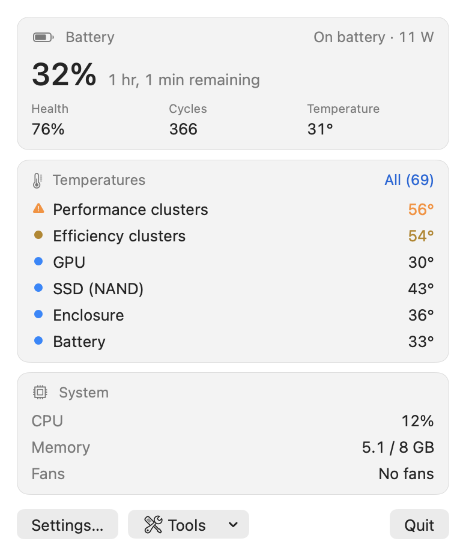
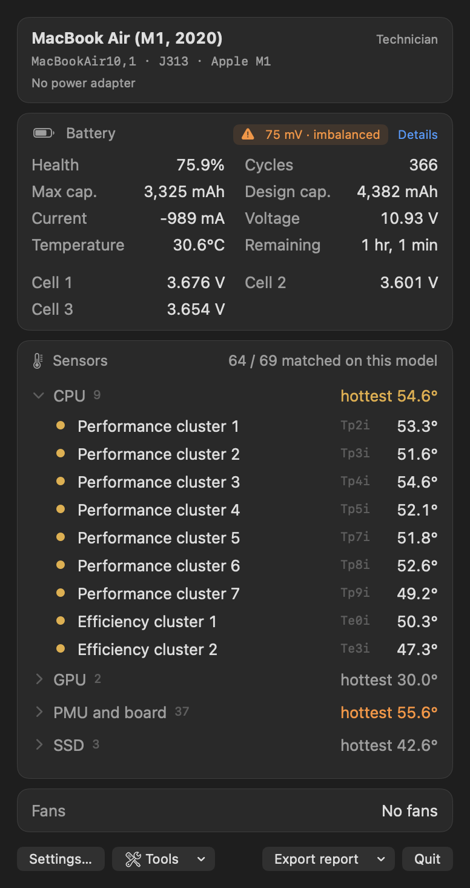
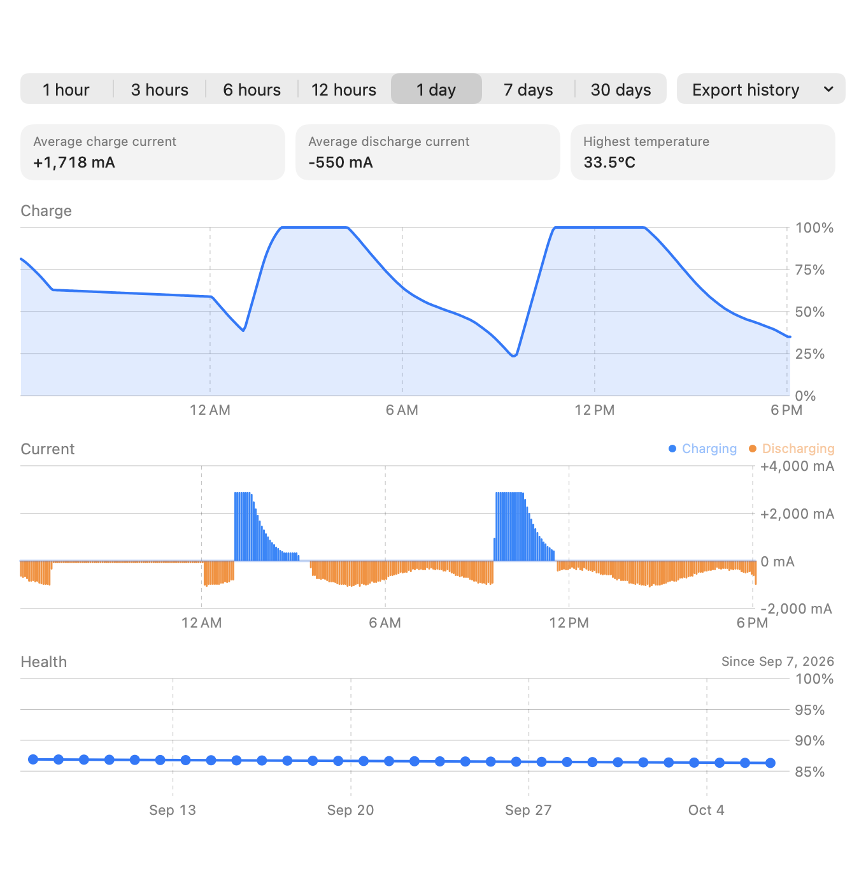

# FixStat

**A free, open-source menu bar monitor for macOS, built for board-level Mac repair.**

[Türkçe](README.tr.md)

> **Test release.** FixStat currently requires **macOS 14 Sonoma or later**.
> Support for older macOS versions, down to **macOS 10.13 High Sierra**, is coming soon.
>
> **No download yet.** There is no ready-made `FixStat.app` on the Releases page yet —
> the first release (v1.0) is still being prepared. Until then FixStat can only be
> [built from source](#installation).

FixStat shows battery, temperature, fan and system data in the menu bar — with
sensor names that were verified per Mac model, and a technician mode with the raw
battery gauge data you normally dig out of `ioreg`.

| Default | Technician mode |
|---|---|
|  |  |


<sub>Battery history window, shown with sample data.</sub>

## How it differs from Stats and iStat Menus

- **Model-specific, verified sensor names.** Other monitors show raw keys
  (`Tp09`, `TG0B`, `PMU tdev7`) or one generic list for all Macs. FixStat keeps a
  per-model [sensor map](SensorMaps/sensor-map.json). Each entry was found with load
  tests (single core, all cores, GPU, SSD, charger) and is marked **verified** when a
  test confirmed it, or **estimated** otherwise — the UI says which is which.
- **Layered lookup.** Model entry first, then an entry for the same chip, then a guess
  from the key pattern (`Tp`, `Te`, `Tg`, `TB`, `TH`, `NAND`, `PMU tdie` …). Chip and
  pattern names are always shown as estimated. Apple Silicon die sensors are named as
  thermal zones of a cluster ("Performance cluster 3"), not as individual cores.
- **Technician mode.** Design and raw maximum capacity, health to one decimal, cycle
  count, signed current, voltage, cell voltages with an imbalance warning, the
  adapter's rating and what it actually delivers right now (`SystemPowerIn`), every
  sensor with its raw SMC / HID key, and the unmatched sensors in a separate list.
- **Board-level details.** HID sensors are joined with their SMC keys (the HID
  `LocationID` is the SMC key), so e.g. `TCHP` shows up as the charger-side NTC read
  through `PMU tdev7`.
- **Battery history.** Charge, current and health from the last hour up to 30 days,
  plus a daily health log that is kept indefinitely.
- **Diagnostics in one app.** Post-repair stress test, SSD health (NVMe SMART) with a
  write–verify stress test and an optional full surface scan, memory test, kernel panic
  and shutdown cause history, battery and power adapter originality check, battery
  capacity (discharge) test, sleep / wake analysis with battery drain while asleep and
  while shut down, a device card (Activation Lock, MDM, part number), and a
  hardware check (keyboard, trackpad surface, display, speakers, microphone, camera,
  Wi-Fi, Bluetooth, USB-C ports with fault counters, lid sensor).
- **Reports.** PDF / CSV / JSON export for customer devices, serial numbers always masked.
- **Read-only.** FixStat never writes to the SMC, has no fan control and needs no
  administrator rights. The only exception is the optional full SSD surface scan, which
  asks for your password and Full Disk Access and only reads the disk.

## Verified models

| Model identifier | Mac | Chip | Board | Sensors named | Verified by test | macOS |
|---|---|---|---|---|---|---|
| `MacBookAir10,1` | MacBook Air (M1, 2020) | Apple M1 | J313 | 64 of 69 | 16 | 26.6 |

Other Macs work too: sensors are then named from chip and key patterns and marked as
estimated. Please help add your model — see [CONTRIBUTING.md](CONTRIBUTING.md) or open a
[new model issue](../../issues/new?template=new-model-sensor-data.yml).

## Installation

**Step-by-step guide: [INSTALL.md](INSTALL.md)** — download, first launch of the unsigned
app, menu bar, open at login, updating, uninstalling and troubleshooting.

In short (macOS 14 Sonoma or later):

1. Download `FixStat.dmg` from [Releases](../../releases), open it and drag FixStat onto
   the Applications folder in its window.
2. FixStat is not notarized by Apple, so the first launch is blocked once: open it, then
   click **Open Anyway** in **System Settings › Privacy & Security** (on macOS 14:
   right-click › Open). Or in Terminal:
   ```bash
   xattr -dr com.apple.quarantine /Applications/FixStat.app
   ```
3. FixStat runs in the menu bar (no Dock icon). **Open at login** is in its settings.

To build from source (Xcode 16+, no other tools):

```bash
git clone https://github.com/BurakFixLab/fixstat.git
cd fixstat
git config core.hooksPath .githooks   # privacy check before each commit
scripts/build-app.sh                  # builds build/FixStat.app
open build/FixStat.app
```

## Command-line tools

```bash
swift build -c release
.build/release/sensordump             # battery, temperatures, fans as tables
.build/release/sensordump --json      # the same as JSON
.build/release/sensordump --raw       # plus every AppleSmartBattery registry value
.build/release/sensormap record       # load tests to identify sensors (see CONTRIBUTING)
```

`sensordump` masks serial numbers unless `--include-serial` is given.

## Language

FixStat follows the system language; English and Turkish are included, other
languages fall back to English. To run FixStat in a different language than the
system, use **System Settings › General › Language & Region › Applications**, add
FixStat and pick a language. Numbers and units follow your region settings.

## Safety and privacy

- **Read-only.** SMC access uses only the key-info, read and read-index commands of
  the `AppleSMC` user client; the write command is not implemented and the C layer
  rejects anything else. No fan control, no root, no `powermetrics`.
- **Private APIs.** Temperatures on Apple Silicon come from `IOHIDEventSystemClient`,
  which is not public API. This is why FixStat is not on the App Store.
- **No network access.** Settings, custom sensor names and battery history stay in
  `~/Library/Application Support/FixStat/`.
- **Serial numbers** are masked in every output and export.

## Acknowledgements

The SMC parameter layout and the IOHID sensor approach follow the public reverse
engineering used by [exelban/stats](https://github.com/exelban/stats) (MIT) and
smcFanControl. FixStat's code is an independent implementation; no code was copied.

## License

[MIT](LICENSE)
