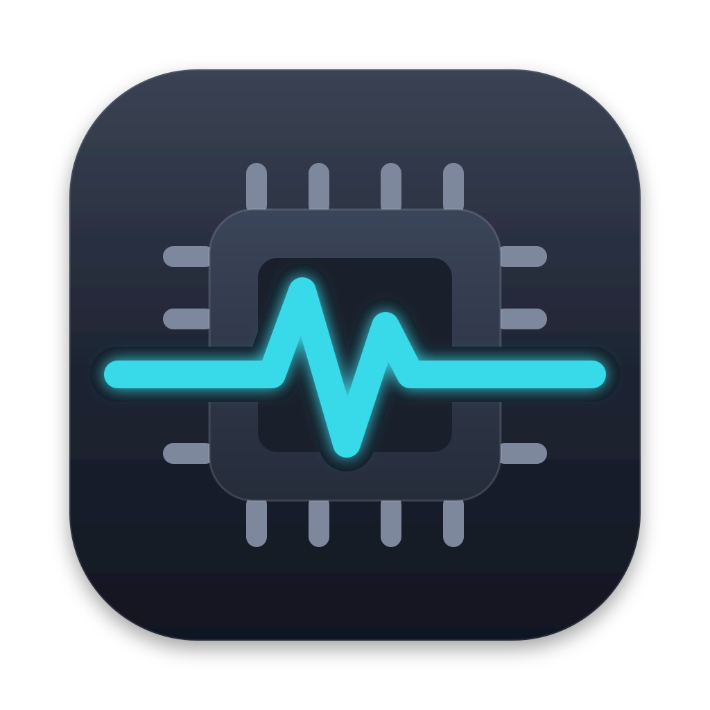
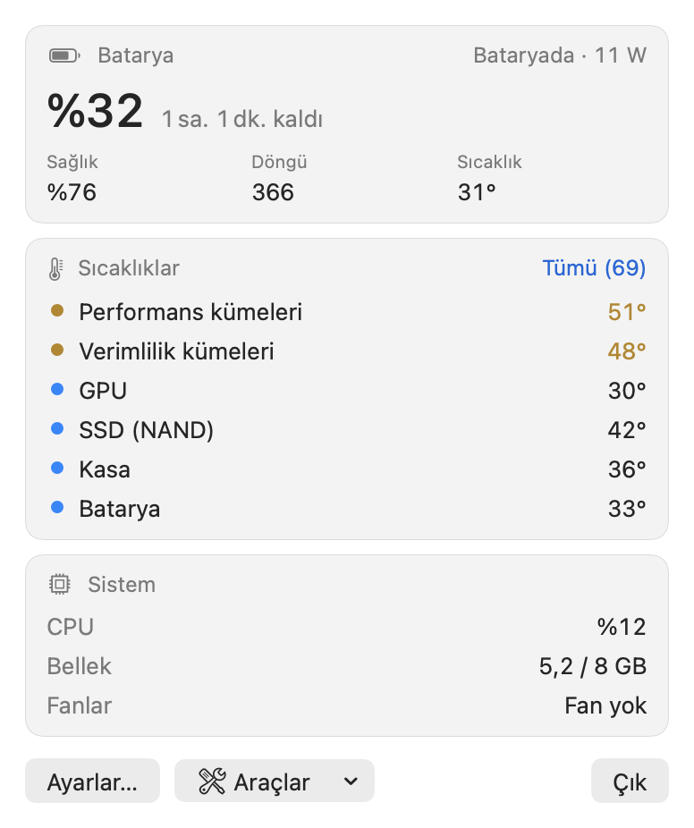
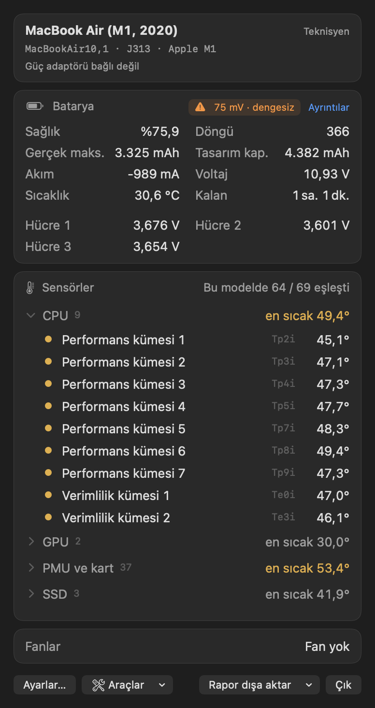
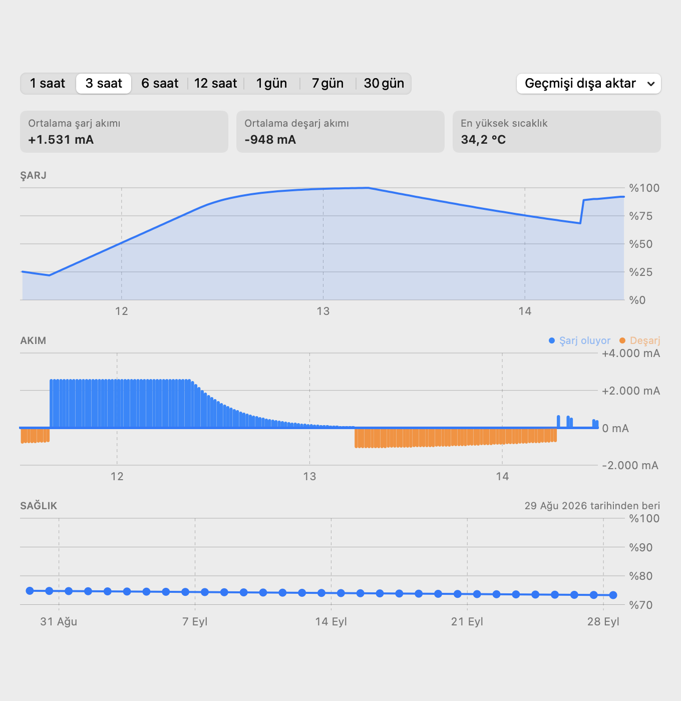

# FixStat

**Kart seviyesinde Mac tamiri için yapılmış, ücretsiz ve açık kaynak bir macOS menü çubuğu izleme uygulaması.**

[English](README.md)

> **macOS 10.13 High Sierra ve üstünde** (Intel) ve **macOS 11 Big Sur ve üstünde** (Apple
> Silicon) çalışır — tek bir universal uygulama. macOS 14 ve sonrasında SwiftUI arayüzü,
> eski sürümlerde aynı özelliklere sahip bir AppKit arayüzü açılır.
> MacBook Air M1 (macOS 26) ve MacBook Air 11" Early 2014'te (Intel, macOS 11) test edildi.
> macOS 10.13 – 10.15 şimdilik yalnızca simülasyonda denendi; Intel'de sensör isimleri hâlâ
> tahminidir — geri bildirimlerinizi bekliyoruz.
>
> **İndirme:** [Releases](../../releases/latest) sayfasındaki `FixStat.dmg`.

FixStat batarya, sıcaklık, fan ve sistem verilerini menü çubuğunda gösterir. Sensör
isimleri Mac modeline göre doğrulanmıştır. Teknisyen modu, normalde `ioreg` içinden
çıkardığınız ham batarya gauge verilerini tek ekranda toplar.

| Varsayılan | Teknisyen modu |
|---|---|
|  |  |


<sub>Batarya geçmişi penceresi, örnek veriyle.</sub>

## Stats ve iStat Menus'tan farkı

- **Modele özel, doğrulanmış sensör isimleri.** Diğer uygulamalar ham anahtarları
  (`Tp09`, `TG0B`, `PMU tdev7`) ya da tüm Mac'ler için tek bir genel liste gösterir.
  FixStat her model için ayrı bir [sensör haritası](SensorMaps/sensor-map.json) tutar.
  Her kayıt yük testleriyle (tek çekirdek, tüm çekirdekler, GPU, SSD, şarj) bulunmuştur;
  test doğruladıysa **doğrulanmış**, doğrulamadıysa **tahmini** olarak işaretlenir ve
  arayüz bunu gösterir.
- **Katmanlı eşleştirme.** Önce model kaydı, sonra aynı çipin kaydı, en son anahtar
  kalıbından tahmin (`Tp`, `Te`, `Tg`, `TB`, `TH`, `NAND`, `PMU tdie` …). Çip ve kalıptan
  gelen isimler her zaman "tahmini" görünür. Apple Silicon die sensörleri tek tek
  çekirdek olarak değil, kümedeki termal bölge olarak adlandırılır ("Performans kümesi 3").
- **Teknisyen modu.** Tasarım ve ham maksimum kapasite, ondalıklı sağlık, döngü sayısı,
  işaretli akım, voltaj, dengesizlik uyarılı hücre voltajları, adaptörün etiket değeri
  ve şu an gerçekte verdiği güç (`SystemPowerIn`), her sensörün ham SMC / HID anahtarı ve
  eşleşmeyen sensörler için ayrı bir liste.
- **Kart seviyesi ayrıntılar.** HID sensörleri SMC anahtarlarıyla eşleştirilir (HID
  `LocationID` değeri SMC anahtarıdır). Örneğin `TCHP`, `PMU tdev7` üzerinden okunan
  şarj devresi NTC'si olarak görünür.
- **Batarya geçmişi.** Son 1 saatten 30 güne kadar şarj, akım ve sağlık; ayrıca süresiz
  tutulan günlük sağlık kaydı.
- **Tek uygulamada tanı araçları.** Tamir sonrası stres testi, SSD sağlığı (NVMe SMART),
  yaz–doğrula stres testi ve isteğe bağlı tam yüzey taraması, bellek testi, kernel panic
  ve kapanma nedeni geçmişi, batarya ve adaptör orijinallik kontrolü, batarya kapasite
  (deşarj) testi, uykuda ve kapalıyken batarya tüketimiyle uyku / uyanma analizi, cihaz
  kartı (Aktivasyon Kilidi, MDM, parça numarası) ve donanım kontrolü
  (klavye, trackpad yüzeyi, ekran, hoparlör, mikrofon, kamera, Wi-Fi, Bluetooth, arıza
  sayaçlı USB-C portları, kapak sensörü).
- **Mac'e uyum.** iMac, Mac mini veya Mac Studio'da batarya araçları gizlenir; donanım
  kontrolü yalnızca o Mac'te bulunan parçaları listeler.
- **Raporlar.** Müşteri cihazları için PDF / CSV / JSON dışa aktarma; seri numaraları,
  Ayarlar'dan tam gösterim açılmadıkça (kendi kayıtlarınız için) maskeli.
- **Sadece okuma.** FixStat SMC'ye hiçbir zaman yazmaz, fan kontrolü yoktur ve yönetici
  izni gerektirmez. Tek istisna isteğe bağlı tam SSD yüzey taramasıdır: parolanızı ve Tam
  Disk Erişimi'ni ister ve diski yalnızca okur.

## Doğrulanmış modeller

| Model kimliği | Mac | Çip | Kart | İsimlendirilen sensör | Testle doğrulanan | macOS |
|---|---|---|---|---|---|---|
| `MacBookAir10,1` | MacBook Air (M1, 2020) | Apple M1 | J313 | 69'da 64 | 16 | 26.6 |

Diğer Mac'lerde de çalışır; o durumda sensörler çip ve anahtar kalıplarından
isimlendirilir ve "tahmini" olarak işaretlenir. **M1 Pro / Max, M2, M2 Pro / Max ve M4**
çiplerinin CPU ve GPU bölgeleri tezgâh kayıtlarından çip bazında isimlendirildi (bu çiplerde
yalnızca SMC anahtarı olarak bulunurlar); bu çipe sahip her Mac, iMac ve Mac mini dahil,
CPU sıcaklığını gösterir. Kendi modelinizi eklemek için
[CONTRIBUTING.md](CONTRIBUTING.md) dosyasına bakın veya
[yeni model issue'su](../../issues/new?template=new-model-sensor-data.yml) açın.

## Kurulum

**Adım adım rehber: [INSTALL.tr.md](INSTALL.tr.md)** — indirme, imzasız uygulamanın ilk
açılışı, menü çubuğu, oturum açılışında başlatma, güncelleme, kaldırma ve sorun giderme.

Kısaca:

1. [Releases](../../releases) sayfasından `FixStat.dmg`'yi indirin, açın ve penceresindeki
   FixStat'ı Uygulamalar klasörüne sürükleyin.
2. FixStat Apple tarafından notarize edilmediği için ilk açılış bir kez engellenir:
   uygulamayı açmayı deneyin, sonra **Sistem Ayarları › Gizlilik ve Güvenlik**'te
   **Yine de Aç**'a tıklayın (macOS 14 ve öncesinde: sağ tık › Aç). Ya da Terminal'de:
   ```bash
   xattr -dr com.apple.quarantine /Applications/FixStat.app
   ```
3. FixStat menü çubuğunda çalışır; Dock simgesi yalnızca pencerelerinden biri açıkken
   görünür. **Oturum açılışında başlat** seçeneği ayarlarındadır.

Kaynaktan derlemek için (macOS 14+ ve Xcode 16 veya üstü, başka araç gerekmez):

```bash
git clone https://github.com/BurakFixLab/fixstat.git
cd fixstat
git config core.hooksPath .githooks   # her commit öncesi gizlilik kontrolü
scripts/build-app.sh                  # build/FixStat.app oluşturur
open build/FixStat.app
```

## Komut satırı araçları

```bash
swift build -c release
.build/release/sensordump             # batarya, sıcaklıklar, fanlar (tablo)
.build/release/sensordump --json      # aynısı JSON olarak
.build/release/sensordump --raw       # ayrıca tüm AppleSmartBattery registry değerleri
.build/release/sensormap record       # sensörleri tanımlamak için yük testleri (CONTRIBUTING'e bakın)
```

`sensordump`, `--include-serial` verilmedikçe seri numaralarını maskeler. Komut satırı
araçlarının çıktısı yalnızca İngilizcedir.

## Dil

FixStat sistem dilini izler; İngilizce ve Türkçe dahildir, diğer dillerde İngilizce
açılır. FixStat'ı sistemden farklı bir dilde kullanmak için **Sistem Ayarları › Genel ›
Dil ve Bölge › Uygulamalar** bölümüne FixStat'ı ekleyip dil seçin. Sayı ve birim
biçimleri bölge ayarınızı izler.

## Güvenlik ve gizlilik

- **Sadece okuma.** SMC erişimi, `AppleSMC` user client'ının yalnızca anahtar bilgisi,
  okuma ve indeksle okuma komutlarını kullanır. Yazma komutu hiç yazılmamıştır ve C
  katmanı başka her komutu reddeder. Fan kontrolü, root yetkisi ve `powermetrics` yoktur.
- **Özel (private) API'ler.** Apple Silicon'da sıcaklıklar herkese açık olmayan
  `IOHIDEventSystemClient` API'sinden okunur. FixStat'ın App Store'da olmamasının
  sebebi budur.
- **Veri toplamaz.** FixStat hiçbir veri toplamaz ve hiçbir yere göndermez: analiz,
  telemetri, güncelleme kontrolü yoktur, ağ erişimi hiç yoktur. Ayarlar, özel sensör
  isimleri ve batarya geçmişi Mac'inizde `~/Library/Application Support/FixStat/`
  klasöründe kalır; raporlar yalnızca siz dışa aktardığınızda oluşturulur.
- **Seri numaraları** her çıktıda ve dışa aktarmada maskelenir; Ayarlar'da "Raporlarda seri
  numaralarını tam göster" açılırsa raporlarda tam görünür (varsayılan kapalı).

## Teşekkür

SMC parametre yapısı ve IOHID sensör yaklaşımı, [exelban/stats](https://github.com/exelban/stats)
(MIT) ve smcFanControl'ün kullandığı herkese açık tersine mühendislik bilgisine dayanır.
FixStat'ın kodu bağımsız olarak yazılmıştır; kod kopyalanmamıştır.

## Lisans

[MIT](LICENSE)
